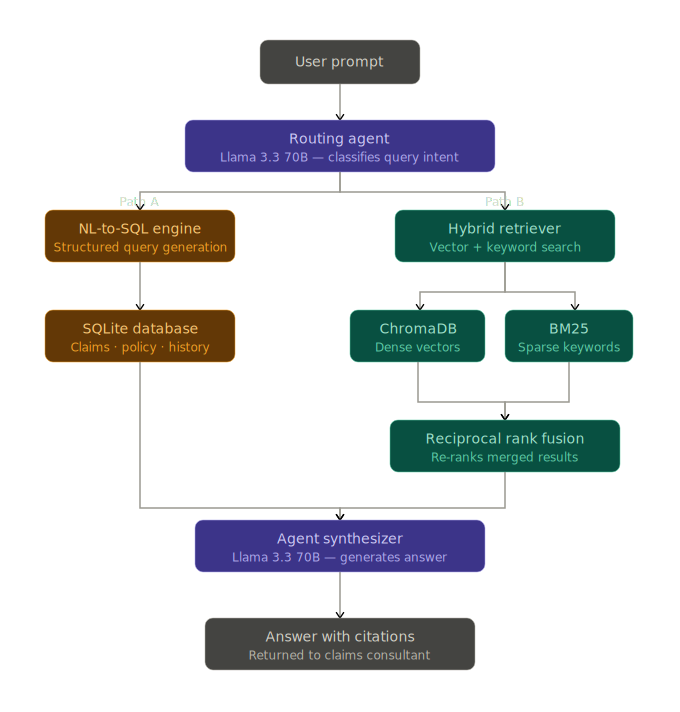

# 🛡️ Claims Agentic RAG: Multi-Route Hybrid Retrieval System


An enterprise-grade, Proof-of-Concept (POC) Agentic RAG application designed to unify siloed structured and unstructured data. This project demonstrates how to build an intelligent routing agent capable of writing complex SQL queries against relational databases, performing advanced Hybrid Search over OCR text narratives, and evaluating its own accuracy using an automated LLM-as-a-Judge pipeline.

## 🧠 The Problem & The Solution

In industries like Insurance, Legal, and Finance, critical data is divided:
* **Structured Data (SQL):** Claim statuses, financial reserves, dates.
* **Unstructured Data (OCR/Text):** Police reports, claimant narratives, incident descriptions.

Standard Vector Search models suffer from the **"Vector Blindspot"**—they understand semantic meaning but fail to retrieve exact alphanumeric IDs (e.g., `CLM-00788`). 

**The Solution:** This project implements an **Agentic Router** that intercepts user queries and routes them to specialized engines. Unstructured queries utilize **True Hybrid Search**, combining Dense Vector embeddings (meaning) with Sparse BM25 retrieval (exact keywords) and merging them using **Reciprocal Rank Fusion (RRF)** for 100% retrieval accuracy on exact IDs.

---

## 🏗️ System Architecture



1. **User Prompt** ➡️ **Llama 3.3 70B Routing Agent**
2. **Routing Agent** branches into two paths:
   * **Path A (Structured):** Natural Language to SQL Engine ➡️ queries SQLite Database. Includes custom logic to double-escape apostrophes and prevent SQL injection/syntax crashes.
   * **Path B (Unstructured):** Hybrid Retriever ➡️ searches ChromaDB (Vectors) + BM25 (Keywords) ➡️ Merges at Reciprocal Rank Fusion (RRF).
3. **Agent Synthesizer** outputs the final answer with precise document citations.

---

## 📊 LLMOps: Automated Offline Evaluation

To ensure production readiness, this repository includes an offline evaluation suite using the **LLM-as-a-Judge** framework (powered by LlamaIndex's `CorrectnessEvaluator`). 

Rather than relying on manual testing ("vibe checking"), the `evaluate_rag.py` script runs a headless version of the Agent against a "Golden Dataset" of expected answers, scoring retrieval and synthesis accuracy from 1.0 to 5.0. It features built-in error handling for rate limits and iteration loops.

---

## 🛠️ Tech Stack

* **Orchestration / Agent:** LlamaIndex & Llama 3.3 70B (via Groq API)
* **Embedding Model:** Ollama (`nomic-embed-text` running locally)
* **Vector Database:** ChromaDB
* **Sparse Retrieval:** BM25
* **Relational Database:** SQLite
* **User Interface:** Streamlit

---

## 📂 Repository Structure

```text
claims-agentic-rag/
│
├── data/
│   └── txt/                     # Raw OCR text documents (dummy data)
│
├── app.py                       # Main Streamlit UI & Agentic Workflow
├── evaluate_rag.py              # LLM-as-a-Judge offline evaluation pipeline
├── eval_dataset.csv             # "Golden" Q&A dataset for evaluation
├── ingest_vector.py             # ETL script: builds ChromaDB & BM25 indices
├── ingest_csv_into_sqlite.py    # ETL script: builds the structured SQLite database
├── claims_rag_routing_architecture.svg # Architecture diagram
├── requirements.txt             # Python dependencies
├── .gitignore                   # Ignored files (venv, DBs, generated reports)
└── README.md                    # Project documentation
```

🚀 Installation & Setup
1. Clone the Repository
git clone [https://github.com/mandagopal/claims-agentic-rag.git](https://github.com/mandagopal/claims-agentic-rag.git)
```text
cd claims-agentic-rag
```
2. Create and Activate Virtual Environment
```text
python3 -m venv venv
source venv/bin/activate  # On Windows use: venv\Scripts\activate
```
3. Install Dependencies
```text
pip install -r requirements.txt
```
4. Set Environment Variables
You will need a free API key from Groq.
```text
export GROQ_API_KEY="your_groq_api_key_here"
```
5. Build the Databases
Ensure Ollama is running locally with the nomic-embed-text model (ollama pull nomic-embed-text).
```text
python3 ingest_csv_into_sqlite.py  # Builds the structured DB
python3 ingest_vector.py           # Builds the ChromaDB vector store
```

6. Launch the Application
```text
streamlit run app.py
```

🧪 Running the Evaluation Pipeline

To test the system's accuracy against the Golden Dataset, run the headless evaluation script. This will generate a local evaluation_report.csv containing scores (1 to 5) and feedback for each query.
```text
python3 evaluate_rag.py
```

💡 Usage Examples

Once the Streamlit interface is running, try asking complex queries that test both databases:

• "What is the total paid amount of all claims?" (Triggers Text-to-SQL)

• "What is the INSURED'S PRELIMINARY RESPONSE provided by Derek Greenfield for the CLAIM #: CLM-00788?" (Triggers Hybrid Vector + BM25 Search)

🔮 Future Enhancements (Roadmap)

• Intent Classification Routing: Decoupling the routing logic from the 70B synthesis model to a lighter, faster 8B model to optimize token usage and cost.

• GraphRAG: Implementing Knowledge Graphs (Neo4j) to map multi-hop relationships (e.g., linking frequent claimants to specific medical providers to detect fraud rings).

• Enterprise Security: Adding Metadata Filtering for Role-Based Access Control (RBAC) and NeMo Guardrails for PII redaction.

